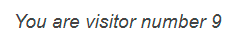

## Step 7: Javascript

We need to include Javascript to call upon our APIs we created earlier. This took me quite a bit of time as I was struggling to find a solution that worked for me, whether I did something wrong in the earlier parts or wasn&#8217;t quite understanding things correctly I&#8217;m not sure. 

Below is my two Javascripts I created, the first one invokes out POST method, which increases the visitor count value on our DynamoDB
```html
<script>
  fetch('https://5cabfxax81.execute-api.ap-southeast-2.amazonaws.com/Prod/', {
    method: 'POST',
    headers: {
      "Content-type": "application/x-www-form-urlencoded; charset=UTF-8"
    },
  })
 
    .then(response => response.json())
    .then(json => {
    console.log(json);
  });
</script>
```
And the second to retrieve the value of the visitor count 


```html

<script>
  fetch('https://5cabfxax81.execute-api.ap-southeast-2.amazonaws.com/Prod/')
      .then((response => response.json()))  
      .then((data) => {document.getElementById("counter").innerHTML = data})                                
</script>
```

We then exchange the value `counter` for the number from the database

```html
	
<p class="subDetails">You are visitor number <span id="counter">loading...</span></p> 

```



## Step 12: Infrastructure as Code

Throughout these steps I have made reference to using CloudFoundation as a first stop as much as possible. If I had to use the GUI first I would export the resources as code via [Former2][1].

  
**Exporting via Former2**  


  * Create a Read-Only IAM user with programmatic access keys, Former2 will use this to scan your infrastructure for deployed resources
  * Run through the setup wizard, it will ask you to install a plugin for your browser, ask for credentials and any other parameters you want to specify. When finished press the Scan Account button.
  * Once scan has completed, click the Dashboard button, you will be presented with all of AWS&#8217;s services. If you click on the service you need the code for you should see your resources listed with some check boxes. If you check the box the resource code will be added to the list to be generated
  * Click generate, you will be presented with a screen with all of the resources you selected coded in YAML.

My template.yaml is stored on my GitHub [here][2]. I&#8217;ve destroyed and reapplied my stack twice to confirm I haven&#8217;t missed anything. Very happy with it.

## Step 13/14/15: Source Control and CI/CD

I&#8217;ve setup all of my code to store in [GitHub][3]. I save my edits in Visual Studio Code and commit to my GitHub repository.  
I have created a AWS Pipeline that monitors my repository for changes and when a commit is received, downloads the repository to the S3 bucket hosting my website and replaces the files, keeping the site up to date within a few seconds of pressing commit.  
I followed the post from Casey McMullen [here][4]

## Step 16: This Blog 

I&#8217;m not the greatest at communicating, both verbal and written, so writing this blog wasn&#8217;t something that came naturally to me. I hope this helps someone out there like other posts on the internet helped me. I am very open to feedback, so if you have anything to share please let me know. I can be reached at <wgarbutt@gmail.com>

 [1]: https://former2.com/
 [2]: https://github.com/wgarbutt/Cloud-Resume-Challenge/blob/main/template.yaml
 [3]: https://github.com/wgarbutt
 [4]: https://aws.plainenglish.io/how-to-set-up-simple-ci-cd-using-aws-codepipeline-with-github-8dc265470184