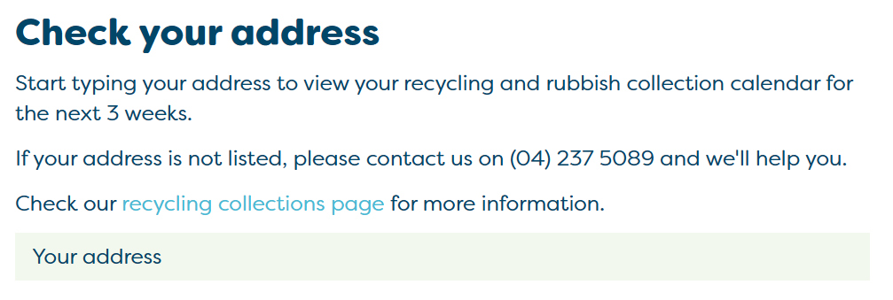

I'm forever one of those people who either forgets to put the bins out or ends up putting the wrong bins out on the wrong days. 
With the mentality of "Automate the boring stuff" I decided to have a go at website scraping with Python to pull the bin schedule from the local council website. 

## PCCBinScraper.py ##
The Porirua City council bin schedule is presented with a convoluted mess of hidden scripts and weird form names. I will make it clear from the beginning here, I heavily relied upon ChatGPT to help me write the code for this script, but even with its help it took a lot of trial and error to finally get meaningful information off of the schedule.

### Address Input ###
The first issue I encountered was getting selenium to find the correct place to put in my address details. It took a lot of time going through the source code for the webpage to see what the text box element was named. Eventually I found the class name and was able to get the webdriver to input my address:

```python
# Find the input field for the address by class name
input_element = driver.find_element(By.CLASS_NAME, 'vue-dropdown-input')
input_element.send_keys(address)
```

### Address Select ###
After putting your address in, regardless if its an exact match or not, a dropdown appears with your address that a user is meant to click on. This bit of code was meant to take care of that.
```python
# Find the address suggestion div element and click on it
try:
    suggestion = driver.find_element(By.XPATH, "//div[@class='vue-dropdown-content']//div[@class='vue-dropdown-item']")
    suggestion.click()
except Exception as e:
    print("Error handling dropdown:", e)
```
But only managed to select the address about half the time. An annoying pop up in Edge kept taking the focus away from the page, causing the dropdown to collapse.
After some extensive googling I found that forcing Edge to run in Guest mode eliminated the "Personalize your web experience" prompt in Microsoft Edge.
```python
# Initialize the Edge WebDriver with options
options = EdgeOptions()
#options.add_argument("--headless")  # Optional: Run the WebDriver in headless mode (without a visible browser window)
options.add_argument("--guest")  # Add the --guest option
driver = webdriver.Edge(options=options)
```


Note: I was unfortunately unable to get the script to run in headless mode, possibly due to how the dropdown is shy and collapses for seemingly no reason at all

### Read the data ###
After selecting your address you get a nice list of upcoming dates and what bins will be collected. We have some smarts added that determines if the data is referring to this current week or next week and store that ready for then next set of steps

``` python
# Parse the page source using BeautifulSoup
soup = BeautifulSoup(page_source, 'html.parser')

# Find all div elements with class 'col-sm-2 col-xs-3' that contain the recycling items
recycling_items = soup.find_all("div", class_="col-sm-2 col-xs-3")

# Create a dictionary to store the recycling items grouped by date
recycling_data = {}

# Get the current day of the week
current_day = datetime.now().weekday()

# Determine the target week based on the current day of the week
if current_day < 3:  # If it's before Thursday (Monday, Tuesday, Wednesday)
    target_week = get_current_week()
else:  # If it's Thursday or later (Thursday, Friday, Saturday, Sunday)
    target_week = get_current_week() + 1

# Loop through each recycling item and extract the date and keyword
for item in recycling_items:
    date_element = item.find_previous("h5", class_="pcc-recycle-date")
    date_str = date_element.get_text(strip=True) if date_element else "Date not found"

    # Convert the date string to a datetime object
    date = datetime.strptime(date_str, "%A, %d %B %Y")

    # Check if the date is within the target week
    if date.isocalendar()[1] == target_week:
        keyword_element = item.find("p", class_="pcc-recycle-label")
        keyword = keyword_element.get_text(strip=True) if keyword_element else "Keyword not found"

        # Append the keyword to the list of keywords for the corresponding date in the dictionary
        if date_str in recycling_data:
            recycling_data[date_str].append(keyword)
        else:
            recycling_data[date_str] = [keyword]
```

### Send the data ###
Now we have a dictionary of a date and keywords we prepare it to send it via MQTT topic in JSON format.
``` python
# Publish the grouped recycling items to MQTT
for date, keywords in recycling_data.items():
    keyword_list = ", ".join(keywords)
    message = f"Date: {date}, Contains: {keyword_list}"
    topic = "recycling_schedule"
    print(f"Publishing message: {message} to topic: {topic}")
    try:
        mqtt_client.publish(topic, message)
    except Exception as e:
        print("Error publishing message to MQTT:", e)
```

## Home Assistant ##
Now that we have the data we want we need a way to make it useful in automation. At the time of writing this post I don't actually have any form of notification or automation set up, but will document here once I have an idea for that.
As of now though I have a nice little tile on the front page of my home assistant site. 

### Sensors ###
This sensor listens for the MQTT topic we are sending our bin data on and adds the date as an attribute to itself.

``` yaml
mqtt:
  sensor:
    - name: "Next bin schedule"
      state_topic: "recycling_schedule"
      value_template: "{{ value_json.Date }}"
      json_attributes_topic: "recycling_schedule"
```
And this one splits out what bins need to go out and add that as an attribute

``` yaml
sensor:
  - platform: template
    sensors:
      next_bin_contains:
        friendly_name: "Next Bin Contains"
        value_template: "{{ state_attr('sensor.next_bin_schedule', 'Contains') | title }}"
```

### Display ###
Finally, we setup a card to display the date in Home Assistant. I'm using the Mushroom custom card pack as it allows for some great flexibility when designing cards.

``` yaml
type: custom:mushroom-title-card
title: |-
  The next bin pickup is:
  {{ states.sensor.next_bin_schedule.attributes.Date }}
subtitle: >
  Put out the  {{ contents[0] }}{{ contents[0] }} and {{ contents[1] }} {{ ',
  '.join(contents[:-1]) }}, and {{ contents[-1] }} bins

```


The Python script can be found [here.][1]


[1]: https://github.com/wgarbutt/pccbinscraper
