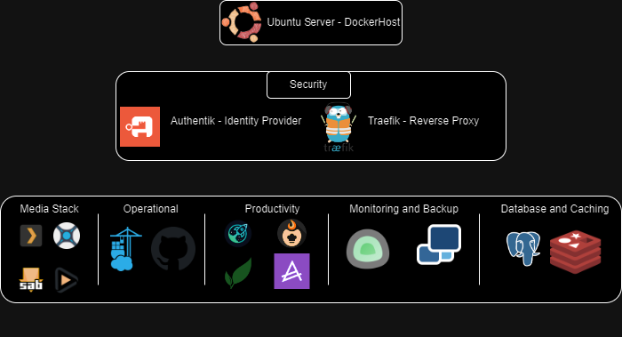

# My Homelab Docker Stack: A Deep Dive into Self-Hosted Services


 So, I've been tinkering with this homelab setup of mine, and I thought it'd be cool to share what I've got going on. If you're into self-hosting stuff and playing around with Docker, you might find this interesting. I'm going to break down the whole stack for you – it's pretty neat, and Im pretty happy with how its turned out. Let's get into it and see what makes this thing tick!


## The Foundation: Docker Compose

## The Foundation: Docker Compose and Learning by Doing

So, this whole project kicked off because I wanted to get my hands dirty with containerization and DevOps stuff. I had dabbled with Docker previously to run some basic services at home but nothing too exciting. I wanted to learn Docker-compose because it seemed to encompass everything I wanted to learn, coding, version control, CI/CD.

At first, there was a lot I couldn't quite get my head around, especially around the Docker Volumes and persistent data. What I found that made things click into place was looking at other peoples compose files online and seeing how their examples fit into what I was struggling with. From there it sort of kept going and soon I had a very large compose file that can build and update my entire environment.

What I've come to really appreciate about Docker Compose is how it simplifies managing complex setups. Instead of dealing with a bunch of containers one by one, I can define my entire stack in a single YAML file. It's made experimenting with different configurations so much easier.

If you're curious about how I've put all this together, you can check out my [GitHub repo](https://github.com/wgarbutt/Docker/). You'll find my Docker Compose file and other configurations there. It's very much a work in progress, so you might see things changing as I learn and try out new ideas.

This hands-on approach has taught me a ton - not just about Docker, but also about networking, security, and how CI/CD pipelines actually work in practice. Building this system has been a great way to apply these concepts in a real-world scenario, and it's been pretty rewarding to see it all come together.

## High-Level Architecture

Before we dive into the details, let's take a look at the high-level architecture of my homelab:



This diagram gives you a bird's-eye view of how all the components in my homelab interact.

## Security First: Authentik and Traefik

### Authentik: Centralized Authentication

At the heart of my stack's security is Authentik, an open-source Identity Provider. It provides centralized authentication for all my services, ensuring that I have a single point of control for user access across my homelab. 

### Traefik: The Reverse Proxy Powerhouse

Traefik serves as my reverse proxy and handles routing for all the services. One of the standout features in my setup is the automatic Let's Encrypt SSL certificate generation. For any service I want to expose, I simply add a few labels to the Docker container, and Traefik takes care of the rest. Here's an example from my Portainer service:

```yaml
labels:
  - "traefik.enable=true"
  - "traefik.http.routers.portainer.tls=true"
  - "traefik.http.routers.portainer.entrypoints=websecure"
  - "traefik.http.routers.portainer.tls.certresolver=letsencryptresolver"
  - "traefik.http.routers.portainer.rule=Host(`portainer.willg.link`)"
```  
With this setup, Traefik:
1. Turns on routing for the service
2. Uses HTTPS
3. Sets up the "websecure" entrypoint
4. Grabs and renews SSL certs automatically
5. Routes `portainer.willg.link` to the right place

It's pretty slick – everything's secure with minimal fuss.

### How It All Flows

Here's a diagram showing how a request bounces through Traefik and Authentik before hitting the actual service:


This shows the journey of a request from your browser to the service you're trying to reach. 

## The Services

Alright, let's break down the containers in this setup:

### Media Stack
- **Plex**: My personal Netflix. All my media, streamed wherever I want.
- **Sonarr and Radarr**: These guys automatically hunt down and grab my TV shows and movies.
- **SABnzbd**: The reliable workhorse for downloading from Usenet.

### Development and Operations
- **Portainer**: Makes managing Docker containers a breeze with a nice web UI.
- **GitHub Runner**: My new CI/CD buddy (more on this later).

### Productivity and Personal Management
- **Dashy**: A slick dashboard to access all my services quickly.
- **Actual Budget**: Keeps my finances in check without relying on cloud services.
- **Tandoor**: Because even my recipes deserve a fancy management system.
- **Paperless-ngx**: Helping me pretend I'm organised by digitizing my documents.

### Monitoring and Backup
- **Uptime Kuma**: Keeps an eye on all my services and lets me know if something's acting up.
- **Duplicati**: Backs up my stuff so I don't lose my mind if something crashes.

### Database and Caching
- **PostgreSQL**: The sturdy database behind a bunch of my services.
- **Redis**: Speedy in-memory data store, mainly for Authentik but handy for other stuff too.

## Networking and Volumes

I've got a dedicated network called `reverse_proxy` for all these services to chat securely. For data storage, I'm using Docker volumes with bind mounts to my host system. Makes backups and migrations way less of a headache.

## Automated Deployment with GitHub Actions

Recently, I leveled up my game by swapping out Jenkins for a GitHub Actions workflow with a self-hosted runner. It's made deploying changes to my homelab setup smoother than ever. Here's what happens when I push changes to the `main` branch:

### GitHub Actions Workflow

The workflow kicks off automatically on every push to `main`, and it does a few key things:

1. **Gitleaks Scan**: Checks for any accidental commits of sensitive info.
2. **Linting Scan**: Makes sure my code doesn't look like a dumpster fire.
3. **Local Runner Deployment**: If all checks pass, it deploys the changes right on my homelab.

Here's the core of my GitHub Actions workflow:

```yaml
name: Update Docker Containers

on:
  push:
    branches:
      - main

jobs:
  update:
    runs-on: self-hosted
    steps:
      - name: Change to project directory and pull changes
        run: |
          cd /container_data/Docker
          git pull origin main

      - name: List directory contents
        run: |
          pwd
          ls -la

      - name: Check Docker Compose file
        run: |
          if [ -f "docker-compose.yml" ]; then
            echo "docker-compose.yml exists"
            cat docker-compose.yml
          else
            echo "docker-compose.yml not found"
          fi

      - name: Stop running containers
        run: docker-compose -f /container_data/Docker/docker-compose.yml down

      - name: Start updated containers
        run: docker-compose -f /container_data/Docker/docker-compose.yml up -d --build

      - name: Check Docker status
        run: |
          docker info
          docker-compose version
```
### Workflow Breakdown

1. **Repository Update**: Pulls the latest changes from the main branch.
2. **Environment Check**: Makes sure everything's where it should be.
3. **Container Management**: Stops the old containers and fires up the new ones.
4. **Status Check**: Double-checks that everything's running smoothly.

### Why This Rocks

1. **Automated Security Checks**: No more accidental leaks of sensitive stuff.
2. **Code Quality**: Keeps my code clean and consistent.
3. **Quick Deployments**: Changes go live fast, without me having to SSH in and do it manually.
4. **Local Control**: Since it's a self-hosted runner, I'm in charge of where and how things deploy.
5. **Visibility**: The GitHub Actions interface shows me exactly what's going on with each deployment.

This automated workflow has been a game-changer for managing my homelab. I can push changes with confidence, knowing they'll be thoroughly checked before going live.

## Wrapping Up

So, that's my homelab Docker stack in a nutshell. It's been a fun project to put together and it's constantly evolving. From streaming my media to managing my finances and documents, it's all running right here at home, under my control.

The combo of Authentik for security and Traefik for routing has made it super easy to add new services and keep everything locked down. And now with the GitHub Actions workflow, keeping it all up to date is a breeze.

If you're thinking about diving into the world of self-hosting, I can't recommend it enough. It's a great way to learn about containerization, networking, and DevOps practices. Plus, there's something really satisfying about running your own services.

Feel free to check out my [GitHub repo](https://github.com/wgarbutt/Docker/) for more details on the setup. I'm always tweaking things, so you might find some new additions there.


