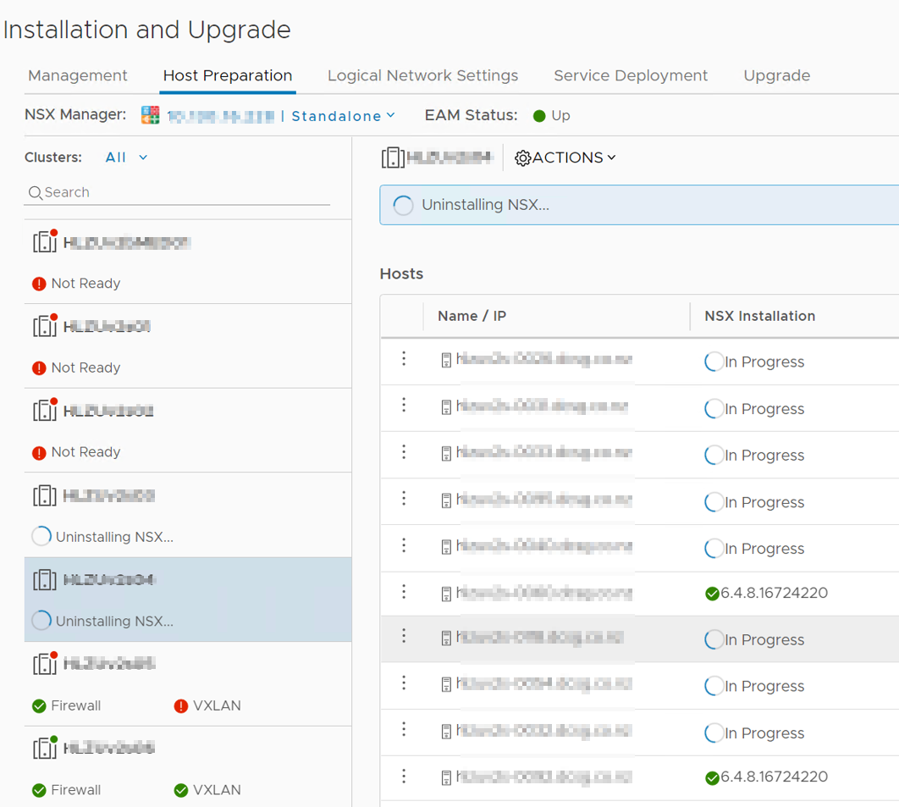
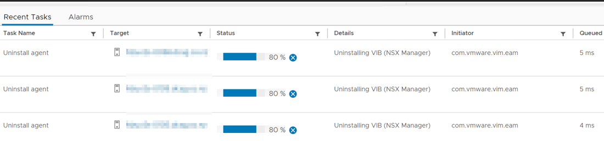

## Removing NSX-V from vCenter

If you're looking to remove NSX-V from your infrastructure, one of the steps you'll need to take is cleaning up any unused NSX-V components from your vCenter server. Here's a step-by-step guide on how to do it.

### Introduction
Before we dive into the steps, let's quickly go over why you might want to remove NSX-V from vCenter. Removing NSX-V can help simplify your infrastructure, reduce overhead costs, and improve overall performance. Now, let's get started!

### Step 1: Check logical switches
First, we need to ensure that no VMs are connected to any logical switches that may be deployed. To do this, navigate to the Logical Switches view in NSX manager. This will list any logical switches that we have deployed into our environment. Looking at the “Connected VMs” column in the list will tell us instantly if there are any VM connections. If there are any VMs connected, these will need to be disconnected before we continue. The best way to do this is to manually edit the settings of any VMs connected to a logical switch and move them to another portgroup.

### Step 2: Remove all Edges
Next, we need to delete any Edges we may have deployed. This should be as simple as right-clicking and selecting delete, ensuring these edges are no longer used prior to doing this.

### tep 3: Delete all logical switches
Now that the logical switches are disconnected from our running VMs and edges are cleaned up and deleted, we can move onto deleting any remaining logical switches. Select a switch and press delete. A message should appear advising if it's safe to delete or not - this is a great little safety measure.

### Step 4: Delete any remaining transport zones
Next, we need to remove any remaining transport zones. These are found in `Installation > Logical Network > Transport Zones`. Again, it should be an easy right-click and selecting remove/delete.

### Step 5: Uninstall NSX VIBs
Now comes the fun part of removing the NSX components from each ESXi host. In `Installation > Host preparation`, you will see each of your clusters listed. Select Actions > Uninstall on the cluster. You will see a hive of activity as the hosts uninstall the VIBs from their systems.

### Step 6: Delete the NSX Manager and controllers
Now we can safely remove all of the VMs that run NSX, the controllers, and the manager. Power them off and delete them from disk.

### Step 7: Removing the plugins from vCenter
The last step in the cleanup process is to remove the NSX pane from vCenter. Here's how:

1. Log into the vCenter MOB `https://<vcenter_name_or_ip>/mob/` with your administrator account.
2. Select content, then on the following page click extension manager.
3. The extensions we are looking to remove are: com.vmware.vShieldManager and com.vmware.nsx.ui.h5.
4. Select Unregister extension and type in the first of the extensions to remove, then select invoke method.
If successful, we should get a message that says Method Invocation Result: void. Continue for the remaining extension.

### Conclusion
And that’s about it! By following these steps, you should have successfully removed NSX-V from both vCloud Director and vCenter. Removing NSX-V can help simplify your infrastructure, reduce overhead costs, and improve overall performance. We hope you found this guide helpful!

Thanks to the help of [this][1] blog post for helping me understand the process

[1]: https://vswitchzero.com/2017/06/06/completely-removing-nsx/ 