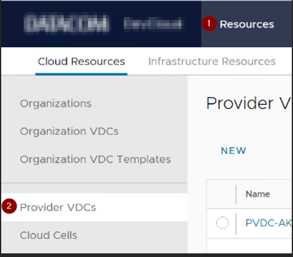
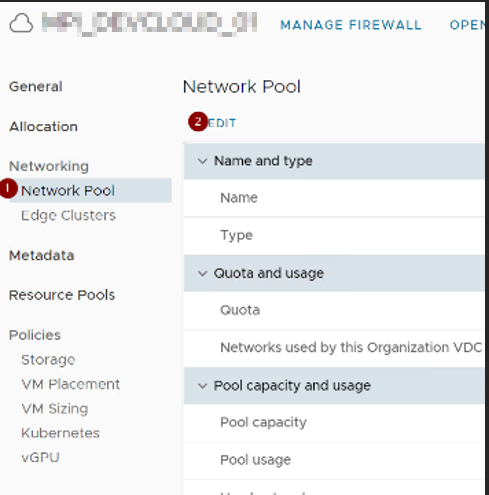
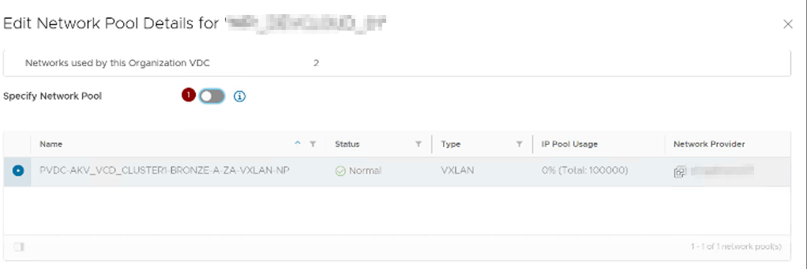

It's no secret that NSX-V reached end of life in early 2022, leaving many companies scrambling to migrate their infrastructure to NSX-T. Any competent VMWare engineer should be well aware of this transition and understand the importance of making the switch.

In my workplace, we initially believed that multiple NSX instances were essential for vCloud Director to function, due to its heavy reliance on NSX for support. However, during our NSX migration plan, we discovered that as of version 10.X, this was no longer the case. We were relieved to find out that vCloud Director could continue to operate without an NSX backing, as long as we didn't utilize any NSX functions. Fortunately for me, this was indeed the scenario in our workplace.

## Removing Network Pools
To begin the process of separating vCloud Director from NSX, the first step we took was to unpin the organizations from their respective network pools. This allowed us to isolate the NSX functionality and ensure that vCloud Director was no longer dependent on it.

The process of unpinning the organizations from their respective network pools involved several steps:

Step 1: Log in to the provider VCD portal, click on the "Resources" tab on the top menu, and select "Provider VDCs" on the left menu.

Step 2: Select the first Provider VDC, then choose the customer organization. Within the customer org, select the "Network Pool" and click on "Edit."

Step 3: Unselect the "Specify Network Pool" option and click "Save." Repeat this step for all other organizations that are currently pinned to the network pool.

Step 4: Once all orgs have been removed from the network pool, the pool can be deleted and cleaned up. Click on the "Resources" tab on the top menu, select "Network Pools" on the left menu, and then locate the relevant network pool. Click on the "Delete" button to remove the network pool.

## Disconnect vCloud from NSX
After unpinning the organizations from their respective network pools, the next step was to remove the connection from vCloud Director to NSX. 

To remove the connection between vCloud Director and NSX, we needed to use API explorer tools such as Postman or API Explorer, which is built into vCloud Director.

Using these tools, we were able to access the vCloud API endpoint and execute the necessary commands to remove the NSX references. This involved carefully identifying and removing any references to NSX within the vCloud Director environment.

It's important to note that working with APIs requires a strong understanding of the underlying infrastructure and careful planning to ensure that changes are made safely and effectively. We took great care to thoroughly test the environment after making any changes and to have backups in place in case of any unexpected issues.

For the example below I used Postman

### Step 1: Get the vCloud Director Access Token
1. Make a `POST` request to `https://<VCDURL>/cloudapi/1.0.0/sessions/provider` in Postman.
2. Set the Authorization tab to Basic Auth and enter your vCloud Director username and password in the format of `username@system`.
   
3. In the Headers tab, create a new key/value pair with `Key: Accept` and `Value: application/json;version=36.3`.
   
4. Send the request and check the Results - Header section for the `X-VMWARE-VCLOUD-ACCESS-TOKEN` header. This is your access token.

### Step 2: Get your vCenter URN 
1. Make a `GET` request to `https://<VCDURL>/cloudapi/1.0.0/virtualCenters?page=1&pageSize=25` in Postman.
2. Set the Authorization tab to Bearer Token and paste the access token you obtained in step 1.
3. Keep the same header settings from step 1.
4. After sending the request, copy the URN address with reference to `vcID` from the JSON output to be used in step 3.

### Step 3: Get URN settings
1. Make a `GET` request to `https://<VCDURL>/cloudapi/1.0.0/virtualCenters/<URN VALUE>` in Postman, where `<URN VALUE>` is the URN address you copied in step 2.
2. Keep the same Authorization and Header settings from step 2.
3. Once the request is sent, copy the JSON output to a notepad.
4. Remove the `"nsxManager": {` all the way to the trailing `}` in the JSON output and copy the edited configuration for step 4.

### Step 4: Update the URN settings
1. Make a `PUT` request to `https://<VCDURL>/cloudapi/1.0.0/virtualCenters/<URN VALUE>` in Postman, where `<URN VALUE>` is the URN address you copied in step 2.
2. Keep the same Authorization and Header settings from step 2.
3. In the Body section of the request, paste the edited configuration from step 3.
4. Set the options to `raw` upload and `JSON` file type.

5. Send the request and check the response to confirm that the NSX has been removed from vCloud Director.
6. If the NSX has been removed, the JSON output should say `"nsxVManager": null,`.

That's it! These steps should have successfully removed NSX from vCloud Director using Postman.

