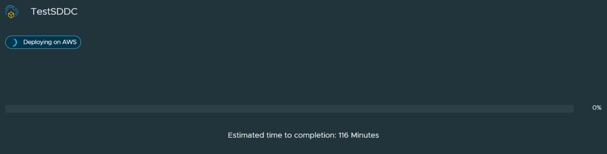

A few months back, I made the decision to resign from my role overseeing a VMWare private cloud platform. It was a significant move after dedicating 13 years of my career to the company. Throughout my tenure, I witnessed VMWare's journey from a groundbreaking newcomer to the pinnacle of IT innovation, only to eventually see it recede into the realms of what some labeled a legacy platform.

From the days of ESXi 5.5 to 7.0, I navigated through the dynamic landscape of VMWare,expecting it to stick around as my go-to until retirement.

The signs were clear for quite a while. The big hyperscalers had been hinting at making their way to New Zealand's shores for ages (and a quick side-note, they owe a debt to VMware for blazing the trail). Customers got swept up in the hype and started migrating from our homegrown cloud platform to these behemoth providers.

I left my job just before the Broadcom takeover and all the drama that ensued. It feels like the final cruel blow for many smaller VMware cloud providers out there.

In my new role, I'm focused on helping businesses transition from on-site VMware infrastructure to the public cloud while keeping the familiarity of vCenter intact and minimizing changes to their workloads. We specialize in VMware Cloud solutions, bridging the gap between traditional setups and modern cloud environments.

In this post, I'll take you through the process of deploying an SDDC and explore the intricacies involved in setting up a Software-Defined Data Center.

## Signing up for VMware Cloud
Before you can deploy an SDDC, you need to sign up to the service via either VMware or your cloud provider of choice (AWS, Azure, or Google Cloud). 
VMware has an article on the process [here][1].
AWS has their product page [here][2].

## Deployment of an SDDC
Once you have purchased an VMware Cloud subscription from your favourite hyperscaller and signed up for a VMware Cloud services portal account, you will be able to start deployment of your SDDC.
The process below I have based off the AWS service, but I believe the process is very similar for all three providers.

When you first log to the cloud services portal you will be presented with a welcome screen with a "Create SDDC" button. If you are serious about VMware cloud and plan to use the service for an extended period the option to purchase a term subscription at a discounted rate is accessible from here.

The next screen is where we choose the name of our SDDC, the region, host type and number of hosts.
A couple of things of note here:
* Zerocloud vs. AWS: Zerocloud will provision an SDDC in minutes, without the associated physical hardware. Whilst the underlying hardware is missing, this step allows you to experience the process of provisioning an SDDC, without waiting 2 hours for it to complete.
* Single host SDDC: The Single Host SDDC configuration is limited to a 60-day lifespan. You can scale up to the minimum 2-host purchase at any point before the 60-day period ends without losing any of your data. If you don't scale up the Single Host SDDC before the end of the service life, the SDDC is deleted along with all the workloads and data it contains.

Next, we'll integrate our AWS account with the VMware Cloud portal. Simply provide your AWS account details, and VMware will initiate a CloudFormation script. This script configures the necessary IAM roles and groups required for VMC to operate smoothly.

Now we need to specify our chosen VPC and subnet in our previously chosen region. The subnet linked to the SDDC must meet a minimum size of /27. However, to fully support the maximum capacity of the SDDC's management cluster, its advised to use a larger /26 subnet.

Now we can specify a management subnet. The Management CIDR is the designated network segment reserved for internal management components within the SDDC. This includes ESXi hosts (management, vMotion, and other interfaces), vCenter, NSX Manager, and any other add-on components deployed within the SDDC, such as HCX. This CIDR is not used for workload VMs.

Once we've completed the configuration we have to confirm we understand the charges for the service and can deploy the SDDC

Deployment takes a while, from my experience with two nodes it takes around 2 hours to deploy and fully start up. 

Once deployed you will see the cloud portal landing page now shows details on your SDDC deployment. From here you will be given the URL, credentials and additional configuration for NSX and deployment options

[1]: https://docs.vmware.com/en/VMware-Cloud-services/services/Using-VMware-Cloud-Services/GUID-92E04F0D-0A4E-4A14-BEE7-EE1E822FAE35.html 
[2]: https://aws.amazon.com/vmware/