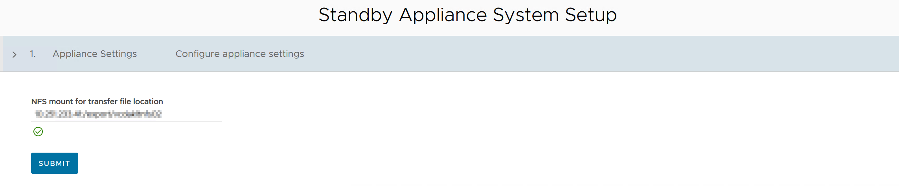

## Introduction:
At our organization, we have been using RHEL virtual machines to support our VMware Cloud Director infrastructure for several years. Our current setup includes two VMs running VCD 10.4.1 cells and a standalone VM running the external Postgres database.

## Prerequisites:
Before deploying the new VCD appliances, there are a few prerequisites to take care of:

1. The VCD appliances require two networks to function properly:
* Front-end network for client and management connections.
* Back-end network for cell-to-cell database traffic. It's usually used for NFS shared transfer connections as well, but not applicable in my case.

2. Create a new NFS share specifically for the new appliances. You cannot reuse the existing NFS share configured for your Linux-based VCD cells.
3. Configure both forward and reverse DNS entries. The cells use this information to identify themselves.

## Deploying Appliances:

1. Download the OVA file for the specific version of VCD that is currently in your environment. Aim for a like-for-like migration without complicating things by trying to upgrade to a later version.
2. Deploy the OVA as you would normally, providing a name for the VM and accepting the license agreement.
3. Select the deployment configuration for the VM. In my setup, I chose to deploy one primary medium-sized VM and two standby medium-sized VMs.

4. Choose the storage location for the VM.
5. Select the networks for eth0 and eth1. In my case, I designated eth0 as the front-end network and eth1 as the back-end network.

6. Provide the NTP Server location, the root password for the appliance, any special routes required for your networks, and the chosen network configuration.
7. Review your settings and click finish to complete the deployment.
   
## Configuring Appliances:
### Primary Cell
1. Once deployed, access the VAMI address `https://<fqdn>:5480` of your primary appliance and log in using your root account and the password you created earlier.
The Primary appliance system setup page will be displayed.

2. Enter the NFS share details and the database password.
3. Fill in the details for your VCD Administrator account, your vCenter folder, and click finish. The Primary node will begin setting up the Postgres database and configuring Cloud Director.

### Standby Cell
1. After setup is complete on the primary cell, log in to the VAMI address of your first secondary cell as the appliance root account you created earlier.
2. The configuration screen of a secondary cell looks a lot simialr to the primary, except all this cell wants is the details for the NFS share. Place those details in and press finish

The secondary cell will then go through a series of steps to configure itself and gain access to the embedded postgres database

3. At this point its a good idea to configure at anti-affinity rule in the vCenter hosting the appliances to keep the cells on different hosts

### Automatic failover 
When you first configure the cells they will be set to Manual failover mode. If the primary database server fails, you must initiate the failover action to a standby cell manually.

You can the failover mode to automatic by making an API post to Cloud director. More information on this can be found [here.][1]

If you have configured automatic failover mode and later add another cell, you will need to reset the failover mode back to automatic. Follow the steps below to accomplish this.

#### Setting automatic failover mode
Using your favourite API Client, in this case I am using Postman.

**Authentication:** Basic mode, using the appliance root password we configured earlier.

**Headers:** Accept application/json

Set the request to `POST` to `https://<appliancefqdn>:5480/api/1.0.0/nodes/failover/automatic`

If you have followed the steps correctly you should get a `202 ACCEPTED` response in your API client.

You will see the Failover Mode is now set to automatic in the VAMI database status page.

Stage 2 will be setting up the migration, will be posting that process here in a few weeks time

[1]: https://docs.vmware.com/en/VMware-Cloud-Director/10.4/VMware-Cloud-Director-Install-Configure-Upgrade-Guide/GUID-5F7D3D46-237E-47E0-B2DF-7B47CC30D06E.html#GUID-5F7D3D46-237E-47E0-B2DF-7B47CC30D06E