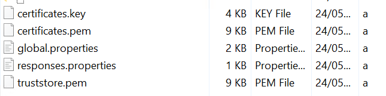
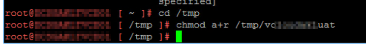
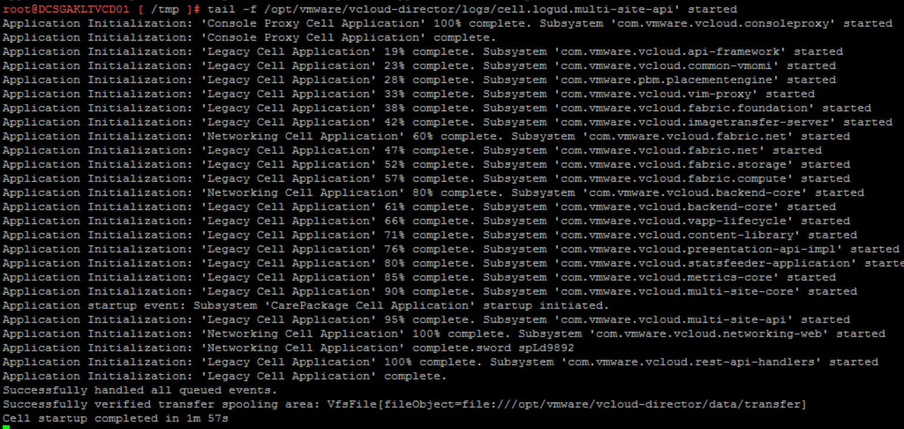
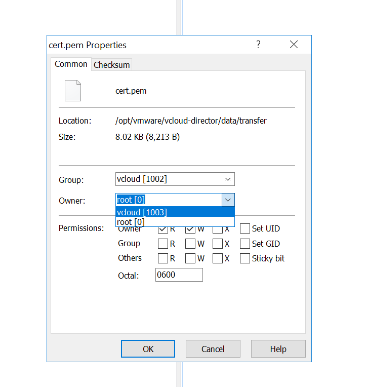
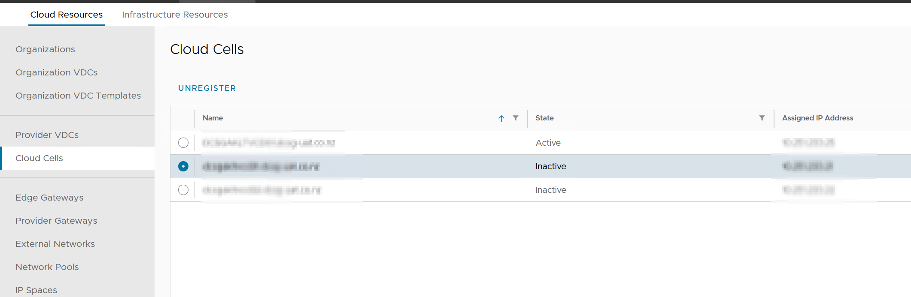

## Introduction
We continue our project to move our VMware Cloud Director deployment from RHEL Linux VMs to purpose-built Photon appliance VMs. In part 1, we deployed our primary and secondary appliances in preparation for the migration. However, during a test migration, I encountered an issue where the secondary nodes were not visible in the new deployment, and after rebooting the primary node, I was unable to access VCD.  After checking the VAMI interface I saw a error message stating the database was corrupted.
Since then, I have successfully completed the migration by starting with a single primary node and deploying the two secondary nodes once everything was confirmed to be working. This is the steps I took.

## Preparation
For this process we are going to need a copy of the Postgres database, and copies of the configuration files that make up VCD.

1. Start by stopping all of your current VCD cells, on each cell run 
`/opt/vmware/vcloud-director/bin/cell-management-tool -u <admin_username> cell –-shutdown`
2. On your Postgres server, backup your database to a location of your choosing. I have chosen /tmp
`pg_dump --dbname=<databasename> --host=<your cell FQDN> --port=5432 --username=vcloud > /tmp/vcloudDB`
3. Using WinSCP, logon to your cell and navigate to `opt/vmware/vcloud-director/etc/` copy the following files to a location off of your cells.
`global.properties`, `responses.properties`, `certificates.pem`, `certificates.key`, and `truststore` 

4. While in WinSCP, copy off your database backup to the same location off the cells.
5. Power off all old VCD cells and Postgres DB servers in your environment.

The cells and database are now safe from any modification, in the event we need to roll back the migration we can simply power off the new cells and power on the old cells and database.

## Migration

### Database Migration
1. Stop the new primary VCD cell
`/opt/vmware/vcloud-director/bin/cell-management-tool cell -i $(service vmware-vcd pid cell) -s`
2. Using WinSCP copy over the database backup we made earlier, I copied it to /tmp in my environment
3. We will need to change the permissions on the database backup. On the SSH session of the primary cell, navigate to the folder you copied the database backup to (/tmp in my case) and run the following:
`chmod a+r /tmp/db_dump_name`

4. Switch the user to postgres, connect to the psql database terminal, and run the statement to drop the vcloud database.
`sudo -i -u postgres /opt/vmware/vpostgres/current/bin/psql -c 'DROP DATABASE vcloud;'`
5. Create a new vcloud database
`sudo -i -u postgres /opt/vmware/vpostgres/current/bin/psql -c 'CREATE DATABASE vcloud;'`
6. Restore the database
`sudo -i -u postgres /opt/vmware/vpostgres/current/bin/psql -U postgres -W -d vcloud -f /tmp/db_dump_name`

Now watch the impressively quick script run through creating tables and transferring data from your old database backup to the new embedded Postgres Database. This process took around 5 minutes for my environment, this time could vary wildly depending on the environment size.

### Configuration Migration
1. In the WinSCP session we had to the primary cell, transfer the configuration files we copied off the old cells earlier,   `global.properties`, `responses.properties`, `certificates.pem`, `certificates.key`, and `truststore` to the following location on the new primary cell
`/opt/vmware/vcloud-director/etc/`
2. Next we need to tell VCD to configure using the files we just transferred across
```
/opt/vmware/vcloud-director/bin/configure --unattended-installation --database-type postgres --database-user vcloud \
--database-password db_password_new_primary --database-host eth1_ip_new_primary --database-port 5432 \
--database-name vcloud --database-ssl true --uuid --cert /opt/vmware/vcloud-director/etc/user.http.pem --key /opt/vmware/vcloud-director/etc/user.http.key --key-password root_password_new_primary --primary-ip appliance_eth0_ip \
```
* The **--key-password** value matches the initial root password of this appliance.
* The **--database-password** value matches the database password that you set during the appliance deployment.
* The **--database-host** value matches the eth1 network IP address of the primary appliance.
* The **--primary-ip** value matches the eth0 network IP address of the appliance.

3. Start your primary cell
`systemctl start vmware-vcd`

You can monitor the cell startup process by typing the following command
`tail -f /opt/vmware/vcloud-director/logs/cell.log.`


## Next steps
Now that we have migrated our configuration and our database we should be able to log into our VMWare Cloud Director deployment pretty much the same way you are used to. I noted that the administrator password I set when deploying my primary cell was overwritten with the old administrator password from my existing deployment.

### SSL Certificates
The new primary cell will have a self-signed SSL certificate. If you require a well-signed certificate you will need to upload your `.pem` and `.key` files to your primary cells transfer location 
`/opt/vmware/vcloud-director/data/transfer/`. This will ensure any new cells will pick up these files automatically upon deployment.

I also needed to copy my cert files to 
`/opt/vmware/vcloud-director/etc/` 
I needed to change the owner of the files to vcloud.vcloud

Then I ran this command to apply the new certificate 
`/opt/vmware/vcloud-director/bin/cell-management-tool certificates -j --cert /opt/vmware/vcloud-director/etc/cert.pem --key /opt/vmware/vcloud-director/etc/cert.key --key-password ks_password_old_VCD`
aI then restarted the cell for the SSL certificate to take hold.

### Remove old cells and add secondary cells
From the top navigation bar, under **Resources**, select **Cloud Resources** and on the left menu click **Cloud Cells**. Select an old cell and click **Unregister**



Now you can go back to part one of my blog and deploy your secondary cells!

Congratulations on migrating VMWare Cloud Director to appliance!