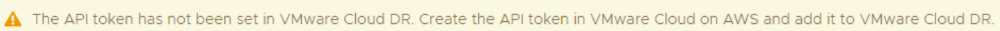

Today, let's kick off by exploring the initial setup for VMware Cloud Disaster Recovery
(VCDR). VCDR is a great addition to your disaster recovery arsenal and brings together
VMware Cloud and AWS to offer you a reliable and user-friendly off-site recovery solution.
I’ve managed to get access to VCDR as an add-on service to our VMware Cloud SDDC
deployment.
Purchasing VCDR is like purchasing the VMC SDDC. You can reach out to either your
VMware or AWS representative and discuss the options tailored to your account.

## Deploying VCDR
Once you have been given access to VCDR you will see a new VCDR tile in your VMware
Cloud service portal. Clicking on the tile brings you to a pre-deployment checklist and details
surrounding your specific subscription.

After selecting the “Activate Region” button, you will be asked what AWS region you want
the deployment to live in. Some regions offer capacity subscription discounts, the region
closest to me unfortunately does not offer this.

Now we simply confirm we understand the hourly charges for running the service and click
finish to start the deployment.

In my experience the deployment took around an hour to run though the appliance
installation and finalise configuration.

Once deployment is completed you will see your VCDR region presented and an option to
start configuring by clicking “Manage Region”

## Configuring VCDR
The first step we need to take is to create an API token to allow VCDR to work on our behalf
with VMware cloud services. This will be evident by the warning message presented to you
as you first log on.

Creating an API token is completed in the VMware Cloud Services portal. In the top right
corner of the portal click on your username. Select My Account > API Tokens.
Click the Generate a New API Token link and give the API token a useful name. You can
choose a lifetime for your token as you wish.
Next we need to define the scopes of the token, and VCDR requires a lot of access:
* Organisation Owner
* Administrator on the VMware Cloud on AWS section
* NSX Cloud Admin on the VMware Cloud on AWS section
Record the API token, if you don’t copy it here you cant access it again and will need to
delete and recreate the token.
Once we have the token, go back to the VCDR console. Click Settings on the left menu
section and select “Configure API Token”.
Here we can validate the token is configured correctly.

### Cloud File System
Now we can go ahead and setup our cloud file system. On the left side menu, select Cloud
File System.

The cloud file system deploys an S3 bucket VCDR will use for storing snapshots of our
protected VMs we’ll setup later. Choose the options that apply to you in the deployment
configuration screen.

The deployment took roughly 10 minutes to complete for me.

Once completed you will be presented with the status of the storage deployment and the
region its situated in.

### Protected Site
Now we can move onto setting up our protected site, click the button on the top right labelled
the same to start the process.

We will need to configure what site we’d like to protect. If you are using direct connect in
AWS, you can configure VCDR to use it on this page.

After finalising your desired configuration hit the setup button. I’ve chosen to protect my on-
site environment.
Now we’re presented with tasks to complete to get everything connected.

Clicking the Deploy button presents us with a page that gives details on the OVA download
URL as well as required firewall rules and passwords we’ll need.
Download the OVA file or copy the URL.
On your on-premises vCenter environment deploy the OVA as your normally would.
Once deployed, SSH into the appliance. The credentials are indicated on the deployment
instructions box we saw earlier. Typically the username is admin and the password is
vmware#1

A configuration wizard will start upon first login. If you have issues you can access the
wizard again by typing “drc setup”
You’ll be prompted for the orchestrator URL, this is detailed in the deployment screen we
saw earlier. The wizard will now check for a connection out to the orchestrator.
I ran into an issue where my firewall was blocking this connection. While working with my
network team I found a useful command to check network connectivity
drc network test –scope cloud

Once we got the firewall sorted, I was able to complete the configuration.

### Register vCenter
Returning to the VCDR console protected site deployment screen I am now able to register
my vCenter

Enter the details for your on-premises vCenter and click register.

Once your vCenter is registered you’ll see you’ll be able to continue onto the next step of
creating protection groups. For me I paused this process and moved on to creating the
Recovery SDDC.

### Recovery SDDC
On the left menu, select Recovery SDDC’s. Select Add recovery SDDC on the top right
corner.
You can choose either your existing SDDC or get VCDR to deploy one for you. Note that if
you choose an existing SDDC you do get warned that if you will have to tear down your
SDDC to remove the VCDR components if you ever choose to.
VCDR will go off and deploy the components into your SDDC, the loading progress bar took
about 5 minutes for me.

After the loading screen completed, I was presented with some error messages as below. It
appears that VCDR was still deploying appliances to the SDDC in the background.

Once I saw the activity was completed in the SDDC the errors disappeared.
I noticed that some new resource pools were created to cater for VCDRs operations.

### Protection Group
We can now go back to creating our protection group. Click Protection group on the left
menu and select Create protection group.

Give your protection group a name and confirm the protected site details.
You can choose to use traditional snapshots or high frequency snapshots.
High-frequency snapshots allow you to schedule snapshot as often as every 30 minutes but
has some strict requirements at the vCenter, host and VM levels. If you choose to use this
option, you will not be able to quiesce the operating system.

VM Name pattern is where you select the VMs to be included in your protection group. For
example, I have used Will* to find my VM named WillTest.

### Recovery Plan
And lastly, we can move onto our Recovery plan creation. On the left side menu choose
recovery plans, select create plan.

Give your plan a name and optional description. Click next.

Go through the recovery options to complete the plan.
